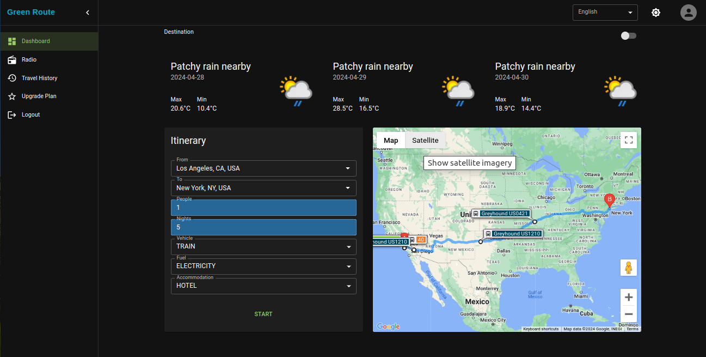
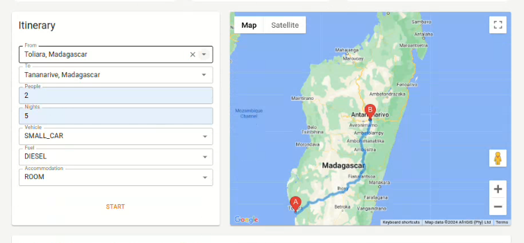
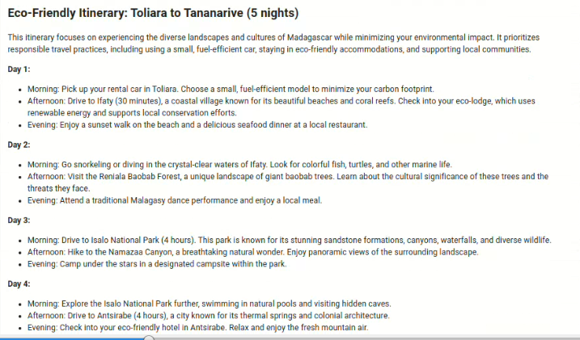
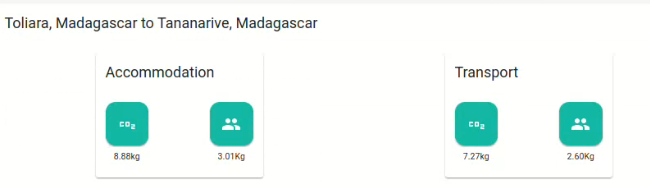
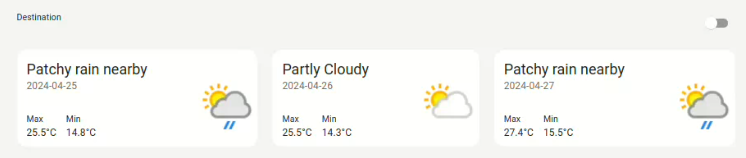
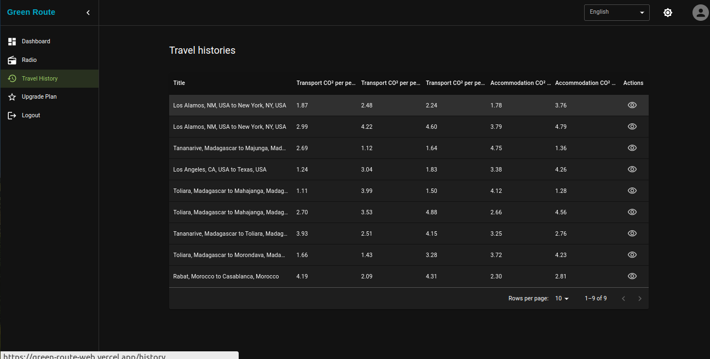
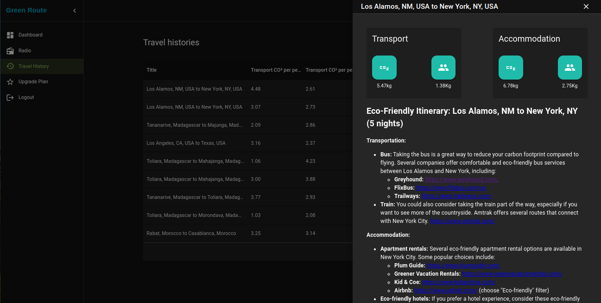
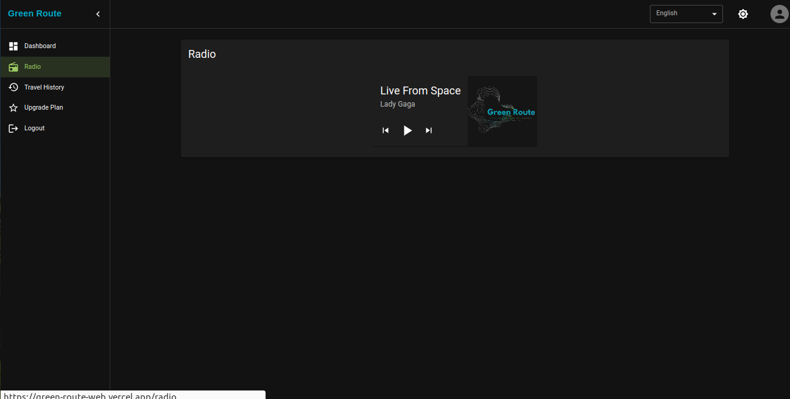
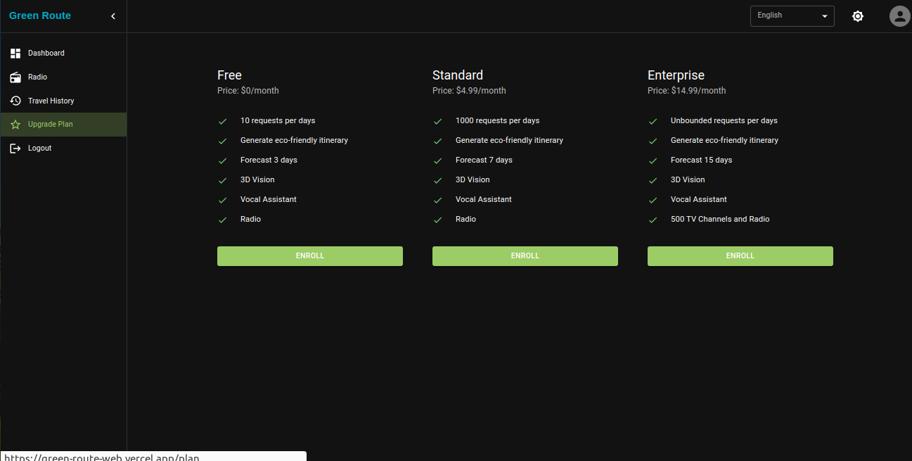

# Green Route

`GreenRoute` is a revolutionary application that leverages `Google's Generative AI` to provide eco-conscious travelers with sustainable and environmentally friendly travel options. By analyzing transportation and accommodation choices, GreenRoute aims to minimize carbon footprints while offering enriching travel experiences.

## Features
**Eco-friendly Route Planning**: Users can input their starting point, destination, and sustainability preferences. GreenRoute then generates eco-friendly routes and provides insightful descriptions on how to enjoy the journey sustainably.

**Environmental Impact Tracking**: Users can monitor their overall carbon footprint and visualize how their travel choices contribute to emissions, empowering them to make informed decisions.

**Weather Forecast**: GreenRoute offers weather forecast for both the origin and destination, ensuring travelers are prepared for their journey.

**History**: Users can view their past travel prompts, helping them track their sustainability progress and revisit memorable trips.

# Upcoming Features

**Virtual Assistant**: Introducing a virtual guide feature to assist travelers during their journeys, providing information and recommendations.

**Radio Stations Integration**: Users can enjoy music and stay informed while traveling by accessing integrated radio stations.

**Business Plan**: A new business plan option will be available for users looking to upgrade their services at an affordable price.

# Installation of this UI
To run the Green Route web application locally using React with Vite, follow these steps:

- ***Prerequisites***:
    - Node.js installed (recommend using Node.js 14+).
    - `npm` package manager installed (optional but recommended).
- ***Install Dependencies:***:
    - Install project dependencies
    <pre>npm install</pre>
- ***Set up environment variable:***:

    Create `.env` file containg this following variables:
    <pre>
        VITE_MAPS_API_KEY=dummy
        VITE_API_BASE_URL=dummy
        VITE_FIREBASE_API_KEY=dummu
        VITE_FIREBASE_AUTH_DOMAIN=dummy
        VITE_FIREBASE_PROJECT_ID=dummy
        VITE_FIREBASE_BUCKET=dummy
        VITE_FIREBASE_MESSAGE_ID=dummy
        VITE_FIREBASE_APP_ID=dummy
        VITE_FIREBASE_MEASUREMENT_ID=dummy
    </pre>
- ***Run the Application***:

    Start the Vite development server:
    <pre>npm run dev</pre>